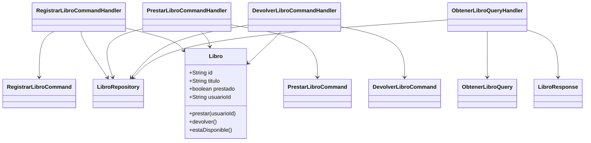

# CQRS Biblioteca – Spring Boot Demo

## Descripción

Este proyecto es una demostración académica de la arquitectura CQRS (Command Query Responsibility Segregation) aplicada sobre Clean Architecture usando Spring Boot. El objetivo es mostrar de forma didáctica cómo separar completamente el modelo de escritura (commands) del modelo de lectura (queries) en un sistema de gestión de biblioteca.

---

## ¿Qué es CQRS?

CQRS es un patrón arquitectónico que propone separar las operaciones de escritura (Command) de las operaciones de lectura (Query) en un sistema. Esto permite que cada lado evolucione de manera independiente, optimizando la lógica de negocio y la consulta de datos.

---

## ¿Por qué CQRS en este proyecto?

- Permite demostrar la separación de responsabilidades de forma clara.
- Facilita la explicación académica de los flujos de modificación y consulta.
- Mejora la mantenibilidad y escalabilidad del sistema.
- Evidencia cómo la lógica de negocio vive en el dominio y no en los controladores.

---

## Estructura del Proyecto

```
com.biblioteca.cqrs
├── application
│   ├── command        # DTOs de escritura
│   ├── query          # DTOs de consulta
│   └── handler        # Orquestadores de comandos y queries
├── domain
│   └── Libro          # Lógica de negocio y entidades del dominio
├── infrastructure
│   └── repository     # Repositorios en memoria (HashMap)
└── controller         # Exposición de endpoints REST
```

### Domain

Contiene la lógica de negocio pura. Ejemplo: métodos prestar(), devolver(), estaDisponible() en la entidad Libro.

### Application

Contiene los DTOs de Command y Query, y los handlers que orquestan el flujo de cada operación.

### Infrastructure

Implementa los repositorios en memoria, sin lógica de negocio, solo almacenamiento.

### Controller

Expone los endpoints REST, delegando la lógica a los handlers. No contiene lógica de negocio.

---

## Flujo de Ejecución

### Registrar libro

1. Controller recibe RegistrarLibroCommand.
2. Handler crea la entidad Libro y la guarda en el repositorio.
3. Logging: [COMMAND] → [DOMAIN]

### Prestar libro

1. Controller recibe PrestarLibroCommand.
2. Handler busca el libro, llama prestar() y guarda el estado.
3. Logging: [COMMAND] → [DOMAIN]

### Devolver libro

1. Controller recibe DevolverLibroCommand.
2. Handler busca el libro, llama devolver() y guarda el estado.
3. Logging: [COMMAND] → [DOMAIN]

### Consultar libro

1. Controller recibe ObtenerLibroQuery.
2. Handler busca el libro y retorna un DTO de lectura.
3. Logging: [QUERY]

---

## Separación entre Command y Query

- Los Commands modifican el estado del sistema.
- Los Queries solo leen datos, sin modificar el estado.
- Cada handler tiene una responsabilidad única.
- No se mezclan flujos de lectura y escritura.

---

## Comparación CQRS vs CRUD tradicional

| CQRS                        | CRUD tradicional           |
|-----------------------------|---------------------------|
| Separación Command/Query    | Métodos combinados        |
| Lógica de negocio en dominio| Lógica en controller      |
| Handlers orquestan          | Controladores gestionan   |
| Escalabilidad didáctica     | Simplicidad, menos clara  |

---

## Diagrama de Clases (Mermaid)



---

## Diagrama de Flujo (Mermaid)


---

## Ejemplo de logs reales

```
[COMMAND] Ejecutando RegistrarLibroCommand: 123 - Clean Architecture
[DOMAIN] Libro marcado como prestado: 123 por usuario 456
[COMMAND] Ejecutando DevolverLibroCommand para libro 123
[DOMAIN] Libro marcado como devuelto: 123
[QUERY] Consultando libro 123
```

---

## Conclusión académica

La arquitectura CQRS, combinada con Clean Architecture, permite una separación clara de responsabilidades, facilitando la escalabilidad, el mantenimiento y la explicación didáctica de los flujos de negocio. CQRS es recomendable en sistemas donde la complejidad de lectura y escritura requiere evoluciones independientes, o cuando se busca claridad en la presentación de conceptos arquitectónicos.

---
